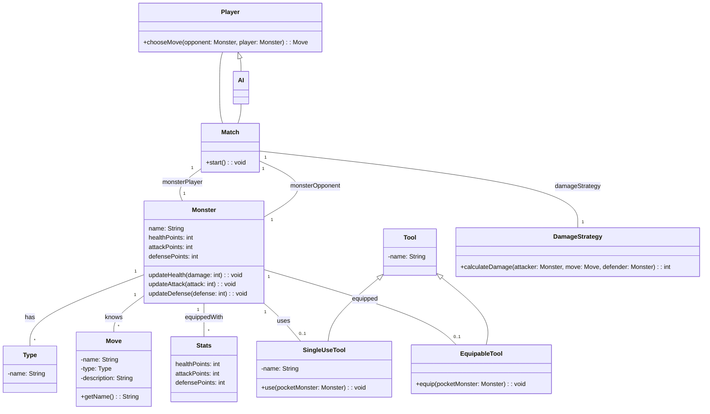

# Relazione di Progetto: Pocket Monster

Questo progetto, sviluppato per il corso di PSS 2024, si propone di creare un gioco di combattimento tra mostriciattoli, ispirato alle meccaniche base del celebre gioco Pokémon.

# Analisi

Il gioco implementerà un sistema a turni in cui un giocatore si confronterà con un'intelligenza artificiale (IA). L'obiettivo è sconfiggere il mostriciattolo avversario. L'IA potrà avere diversi livelli di complessità, da una semplice strategia casuale a logiche più elaborate basate su regole, reti neurali o altri algoritmi.

## Requisiti Funzionali

- [RF1]: Definizione dei mostriciattoli.
- [RF2]: Assegnazione di uno o più tipi a ciascun mostriciattolo (es. fuoco, acqua, terra, aria, ecc.).
- [RF3]: Utilizzo di strumenti curativi o offensivi durante il combattimento.
- [RF4]: Creazione di match tra due mostriciattoli.
- [RF5]: Implementazione di diverse logiche di combattimento basate sui tipi dei mostriciattoli (es. il fuoco è debole contro l'acqua, ecc.).

## Requisiti Non Funzionali

- [RNF1]:  Possibilità di caricare le informazioni dei mostriciattoli da file in modo strutturato.

## Analisi del Dominio

Un mostriciattolo è un'entità caratterizzata da:

- **Nome:** Univoco per ogni mostriciattolo.
- **Tipo:** Uno o più tipi elementali (es. fuoco, acqua, terra, aria, ecc.).
- **Punti Vita (PV):** Rappresentano la salute del mostriciattolo.
- **Punti Attacco (PA):** Rappresentano la forza d'attacco del mostriciattolo.
- **Punti Difesa (PD):** Rappresentano la resistenza ai danni del mostriciattolo.

Esistono degli *strumenti* utilizzabili durante il combattimento, in grado di modificare i PV, PA e PD di un mostriciattolo.  Alcuni strumenti speciali possono essere equipaggiati per potenziare le caratteristiche del mostriciattolo.

Un *match* è una partita tra due mostriciattoli, in cui il giocatore e l'IA si alternano nei turni per sconfiggere l'avversario. Il match termina quando uno dei due mostriciattoli esaurisce i propri PV. Ad ogni turno, il giocatore può selezionare una *mossa* tra quelle disponibili per il proprio mostriciattolo.

Le *mosse* sono associate ai tipi elementali dei mostriciattoli e i loro effetti variano in base al tipo del mostriciattolo avversario (es. una mossa di tipo fuoco sarà più efficace contro un mostriciattolo di tipo erba). Ogni mossa è caratterizzata da un nome, un tipo e un effetto specifico.

