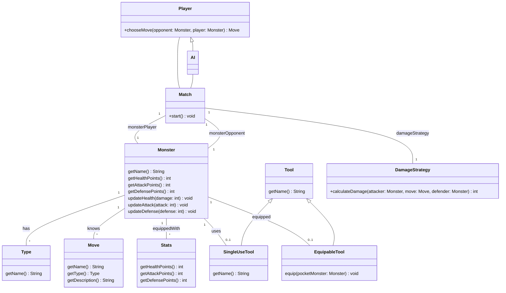
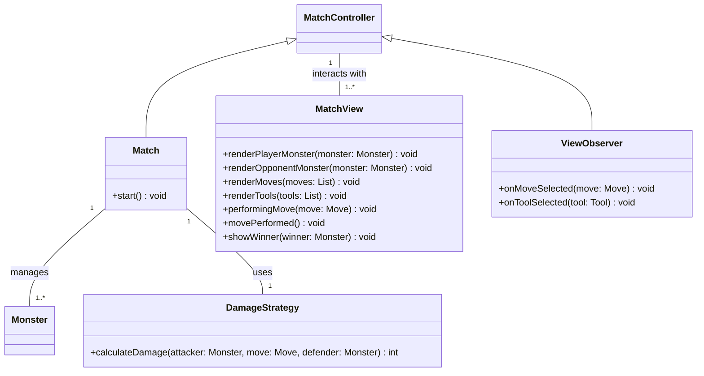
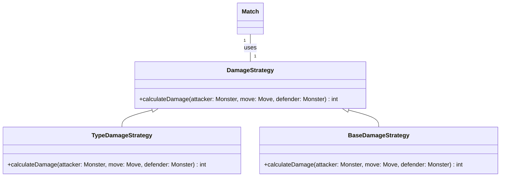

# Relazione di Progetto: Pocket Monster

Questo progetto, sviluppato per il corso di PSS 2024, si propone di creare un gioco di combattimento tra mostriciattoli, ispirato alle meccaniche base del celebre gioco Pokémon.

# Analisi

Il gioco implementerà un sistema a turni in cui un giocatore si confronterà con un'intelligenza artificiale (IA). L'obiettivo è sconfiggere il mostriciattolo avversario. L'IA potrà avere diversi livelli di complessità, da una semplice strategia casuale a logiche più elaborate basate su regole, reti neurali o altri algoritmi.

## Requisiti Funzionali

- [RF1]: Il giocatore deve poter creare e personalizzare mostriciattoli definendo nome, statistiche base (PV, PA, PD) e mosse disponibili.

- [RF2]: Il sistema deve permettere di:
    - Assegnare uno o più tipi elementali a ciascun mostriciattolo
    - Visualizzare i tipi assegnati
    - Considerare le interazioni tra tipi diversi durante il combattimento

- [RF3]: Durante il combattimento, il giocatore deve poter:
    - Utilizzare strumenti curativi per ripristinare PV
    - Impiegare strumenti offensivi per modificare PA/PD
    - Equipaggiare oggetti speciali che potenziano le statistiche
    - Visualizzare l'inventario degli strumenti disponibili

- [RF4]: Il sistema deve:
    - Avviare match tra due mostriciattoli
    - Gestire i turni di combattimento
    - Applicare le regole di vittoria/sconfitta
    - Mostrare lo stato del match (PV rimanenti, effetti attivi)

- [RF5]: Il sistema di combattimento deve:
    - Calcolare i danni in base ai tipi coinvolti
    - Applicare modificatori di efficacia (super efficace, poco efficace)
    - Mostrare feedback sull'efficacia degli attacchi
    - Considerare le resistenze/debolezze dei tipi

## Requisiti Non Funzionali

- [RNF1]:  Possibilità di caricare le informazioni dei mostriciattoli da file in modo strutturato.

## Analisi del Dominio

Un mostriciattolo è un'entità caratterizzata da:

- **Nome:** Univoco per ogni mostriciattolo.
- **Tipo:** Uno o più tipi elementali (es. fuoco, acqua, terra, aria, ecc.).
- **Punti Vita (PV):** Rappresentano la salute del mostriciattolo.
- **Punti Attacco (PA):** Rappresentano la forza d'attacco del mostriciattolo.
- **Punti Difesa (PD):** Rappresentano la resistenza ai danni del mostriciattolo.

Esistono degli *strumenti* utilizzabili durante il combattimento, in grado di modificare i PV, PA e PD di un mostriciattolo.  Alcuni strumenti speciali possono essere equipaggiati per potenziare le caratteristiche del mostriciattolo.

Un *match* è una partita tra due mostriciattoli, in cui il giocatore e l'IA si alternano nei turni per sconfiggere l'avversario. Il match termina quando uno dei due mostriciattoli esaurisce i propri PV. Ad ogni turno, il giocatore può selezionare una *mossa* tra quelle disponibili per il proprio mostriciattolo.

Le *mosse* sono associate ai tipi elementali dei mostriciattoli e i loro effetti variano in base al tipo del mostriciattolo avversario (es. una mossa di tipo fuoco sarà più efficace contro un mostriciattolo di tipo erba). Ogni mossa è caratterizzata da un nome, un tipo e un effetto specifico.

## Architettura

Il sistema è composto da tre macro componenti, che seguono il pattern architetturale Model-View-Controller (MVC):

- **Model:** Contiene le classi che rappresentano il dominio del gioco (mostri, mosse, strumenti, ecc.). Queste classi sono responsabili della gestione delle informazioni e della logica di gioco.

- **View:** Si occupa della presentazione dei dati all'utente, mostrando l'interfaccia grafica e raccogliendo gli input. In questo caso reificata nella classe `MatchView`.

- **Controller:** Gestisce le interazioni tra Model e View, coordinando le azioni dell'utente e aggiornando lo stato del gioco. In questo caso reificata nella classe `Match` e osserva gli eventi generati dalla `MatchView` attraverso il pattern Observer (`MatchObserver`).

In particolare, il `Match` è il componente principale che coordina il flusso di gioco, avviando i match tra i mostriciattoli e gestendo i turni di combattimento. Il `Match` utilizza un'istanza di `Player` per gestire le azioni del giocatore e un'istanza di `AI` per gestire le azioni dell'IA. Il `DamageStrategy` è utilizzato per calcolare i danni inflitti durante il combattimento.

# Design di dettaglio

## Sistema di Combattimento (Intercambiabili)

### Problema
Un match tra due mostriciattoli richiede un sistema di combattimento che calcoli i danni inflitti da un attacco in base ai tipi elementali coinvolti. Questo sistema deve essere facilmente estendibile per supportare diverse strategie di calcolo dei danni.

### Soluzione
In questo caso, si è scelto di seguire il desing pattern Strategy per permettere di definire diverse strategie di calcolo dei danni. In particolare, si è definita l'interfaccia `DamageStrategy` con un metodo `calculateDamage` che restituisce i danni inflitti da un attacco. Le classi concrete che implementano questa interfaccia possono definire regole diverse per il calcolo dei danni, ad esempio basate sui tipi elementali dei mostriciattoli coinvolti.

###
Note: se volete vedere altri desing pattern (su come si usano, guardate qui: https://java-design-patterns.com/).

In particolare, i pattern più usati sono:
- Strategy
- Observer
- Factory
- Singleton
- Builder
- Adapter
- Decorator
- Template Method